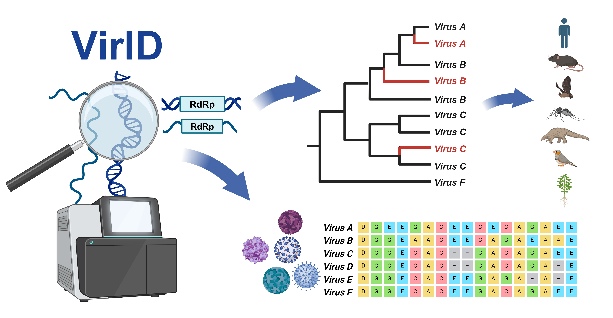
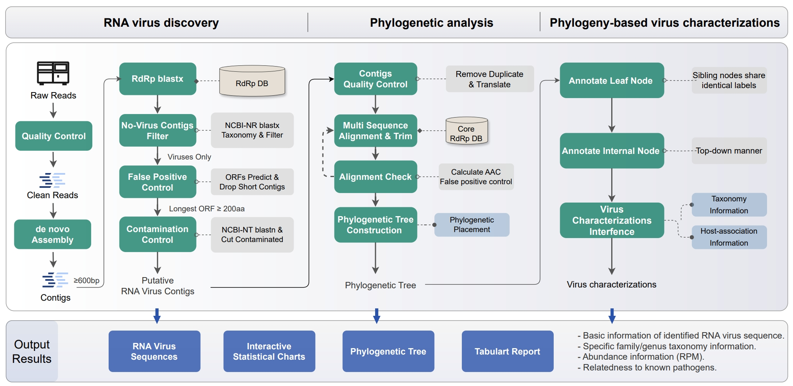

# **VirID**: Beyond Virus Discovery - An Integrated Platform for Comprehensive RNA Virus Characterization



---

RNA viruses exhibit vast phylogenetic diversity and can significantly impact public health and agriculture. However, current bioinformatics tools for viral discovery from metagenomic data frequently generate false positive virus results, overestimate viral diversity, and misclassify virus sequences. Additionally, current tools often fail to determine virus-host associations, which hampers investigation of the potential threat posed by a newly detected virus. 

To address these issues we developed VirID, a software tool specifically designed for the discovery and characterization of RNA viruses from metagenomic data. 

The basis of VirID is a comprehensive RNA-dependent RNA polymerase (RdRP) database to enhance a workflow that includes RNA virus discovery, phylogenetic analysis, and phylogeny-based virus characterization. Benchmark tests on a simulated data set demonstrated that VirID had high accuracy in profiling viruses and estimating viral richness. 

In evaluations with real-world samples, VirID was able to identity RNA viruses of all type, but also provided accurate estimations of viral genetic diversity and virus classification, as well as comprehensive insights into virus associations with humans, animals, and plants. VirID therefore offers a robust tool for virus discovery and serves as a valuable resource in basic virological studies, pathogen surveillance, and early warning systems for infectious disease outbreaks.


---
**Associated papers**


[Yang Z, Shan Y, Liu X, Chen G, Pan Y, Gou Q, Zou J, Chang Z, Zeng Q, Yang C, et al. 2024. VirID: Beyond Virus Discovery - An Integrated Platform for Comprehensive RNA Virus Characterization. Molecular biology and evolution.](https://academic.oup.com/mbe/advance-article/doi/10.1093/molbev/msae202/7781993?searchresult=1)


---


## VirID workflow


| |
|:--:|
| The VirID framework for automated RNA virus detection, which comprises three main stages:(i) RNA virus discovery, (ii) phylogenetic analysis, and (iii) phylogeny-based virus characterization. It produces outputs that include viral sequences, phylogenetic trees, and comprehensive information including sequence length, best match of BLASTx comparison, virus classification, and host association. | 

## Installation
- python>=3.8
- R 4.2

### Step 1: Install conda and third-party dependencies
VirID requires third-party packages from the conda-forge and bioconda channels

```shell
conda create -n VirID
conda activate VirID
```

```shell
conda install -c bioconda blast bbmap seqkit  mafft megahit trimal  pplacer  taxonkit  bowtie2
conda install fastp taxonkit diamond==2.1.4  bowtie2 samtools==1.16.1
pip install Bio biopython DendroPy  matplotlib    numpy   pandas regex seaborn  tqdm
```
**Notes:**

- Version of the tool available for reference:
  - bbduk.sh：bbmap v39.01 ； Seqkit v2.4.0 ；bowtie2 v2.5.1 ；megahit v1.2.9
  - mafft v7.520 ；trimal v1.4.1 ；makeblastdb,blastn,blastp v2.13.0+
  - samtools v1.16.1 ；diamond v2.1.4

- The [taxonkit](https://bioinf.shenwei.me/taxonkit/download/) dataset should also be downloaded!


### Step 2: Install VirID via pip

All python packages will be downloaded automatically!

```shell
pip install VirID
```

### Step 3: Install R and R package

```shell
#install R package
R
if (!requireNamespace("BiocManager", quietly = TRUE))
  install.packages("BiocManager")
BiocManager::install("ggtree")
packages=c("tidyverse"，"ggplot2","RColorBrewer","phangorn","networkD3","jsonlite","dplyr","networkD3","jsonlite")
ipak <- function(pkg){
    new.pkg <- pkg[!(pkg %in% installed.packages()[, "Package"])]
    if (length(new.pkg))  
        install.packages(new.pkg)
    sapply(pkg, require, character.only = TRUE)
}
ipak(packages)
```
**Notes:**
*tidyverse* is based on *systemfonts* and you may need the following code to install it
```shell
conda install r-systemfonts
```

### Step 4: Downloading and configuring the database.

VirID requires an environment variable named `VirID_DB_PATH`, this is the parent directory for the following databases.

See below for specific database configurations.
```shell
#set VirID_DB_PATH to environment variable
export VirID_DB_PATH=/path/to/the/database/
```


**Notes:**

- The databases take up a lot of space, so make sure you have enough disk space. 
If you already have these databases, you can skip the download step and just configure them.

- The download speed of the database depends on the internet. You can also choose other download methods such as `ascp`.


#### rRNA

- 1.1 Download the file from this [link](https://drive.google.com/file/d/1PDbuIG1ZcMRWrQ8nhE50p33B2J1IposQ/view?usp=sharing) or [here](https://zenodo.org/records/10435588/files/VirID_rRNA_db.fasta.bz2?download=1).

- 1.2 Unzip the file and Using ***[bowtie2](https://github.com/BenLangmead/bowtie2)*** to build the index.
    ```shell
    bunzip2 -cv VirID_rRNA_db.fasta.bz2 > VirID_DB_PATH/rRNA/VirID_rRNA_db.fasta
    bowtie2-build VirID_DB_PATH/rRNA/VirID_rRNA_db.fasta VirID_DB_PATH/rRNA/rRNA_cutout_ref
    ```

#### **PROT_ACC2TAXID**

  ```shell
  #Download the `PROT_ACC2TAXID` file
  wget -c https://ftp.ncbi.nlm.nih.gov/pub/taxonomy/accession2taxid/prot.accession2taxid.gz
  wget -c https://ftp.ncbi.nlm.nih.gov/pub/taxonomy/accession2taxid/prot.accession2taxid.gz.md5

  #Check for the file integrity
  md5sum -c prot.accession2taxid.gz.md5

  #Unzip the files and onfiguration
  gunzip -c prot.accession2taxid.gz > VirID_DB_PATH/accession2taxid/prot.accession2taxid
  ```

#### [NCBI Non-Redundant Protein Database (NR)](./info/db_NR.md)


#### [NCBI Nucleotide Sequence Database (NT)](./info/db_NT.md)


## Usage
VirID *medthod* [options]

- medthod:
  - end_to_end
  - assembly_and_basic_annotation
  - phylogenetic_analysis

### Example

```shell
VirID end_to_end  -i 1.fastq -i2 2.fastq \
    -out_dir out_path  --threads 60 --keep_dup
	
VirID assembly_and_basic_annotation -i 1.fastq -i2 2.fastq \
    -out_dir out_path  --threads 60 
	
VirID phylogenetic_analysis -classify_i test/test_contig.fasta   \
	-out_dir out_path   --threads 90 --keep_dup
```


**If you encounter problems during use, feel free to raise an issue.**
